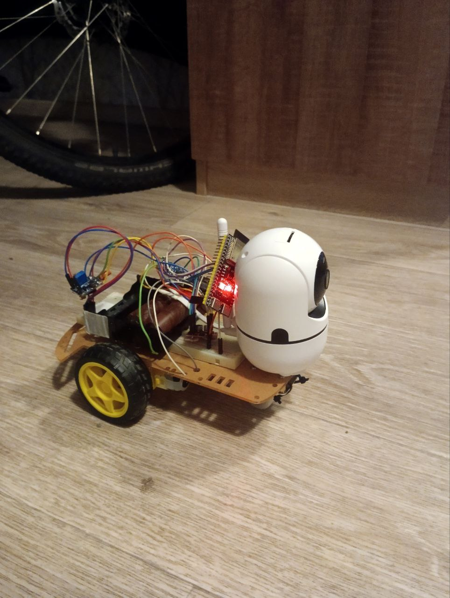
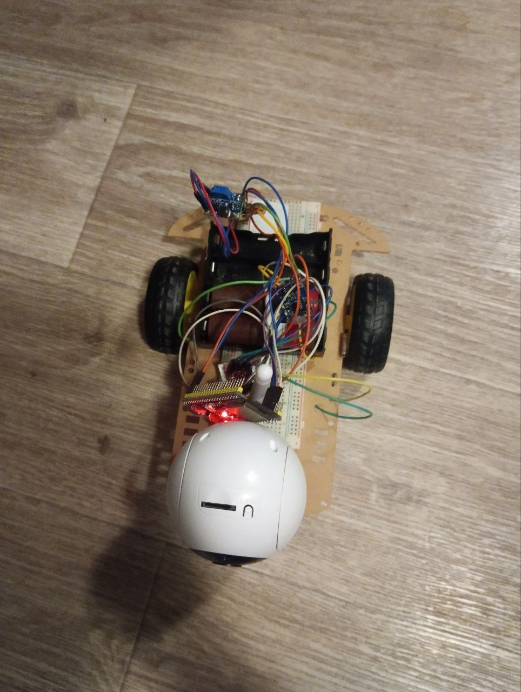
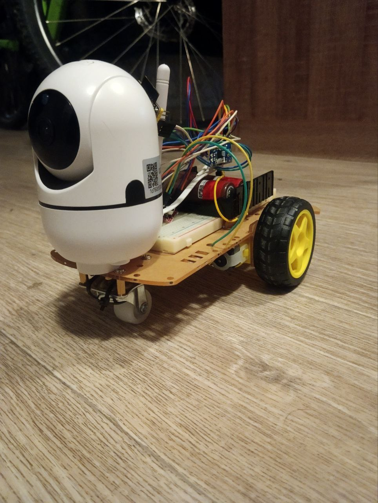

# ESP32 Cat-Following Robot

[](https://github.com/alnibl/ESP32_cat_follower_robot)
[](https://www.espressif.com/en/products/socs/esp32-s3)
[](https://github.com/ultralytics/ultralytics)
[](LICENSE)

> ⚠️ **Статус проекта**: В активной разработке и тестировании
> 🚧 **Текущая версия**: v2.1 (улучшенная система управления моторами)
> 🧪 **Тестирование**: Веб-интерфейс протестирован, автоматические тесты в процессе

Автономный робот на базе ESP32-S3, который использует компьютерное зрение для обнаружения и следования за котом.

## Описание проекта

Робот состоит из:
- **ESP32-S3-DevKitC-1 N8R2** для управления моторами через WiFi
- **2x MX1508** драйверы моторов (двухканальные H-bridge)
- **IP камера** с WiFi для видеопотока (RTSP)
- **Python скрипт** на PC с YOLO11 для детекции кота
- **Веб-интерфейс** для управления и мониторинга

## Системная архитектура

```
IP Камера → WiFi → PC (RTSP поток)
                     ↓
         Python + YOLO11 (детекция кота)
                     ↓
        PC → WiFi → ESP32 (HTTP команды)
                     ↓
          ESP32 → MX1508 → Моторы
```

## Фотографии робота

<div align="center">
  
  <p><i>Общий вид робота с зафиксированным опорным колесом</i></p>
</div>

<div align="center">
  
  <p><i>Вид сверху: расположение компонентов</i></p>
</div>

<div align="center">
  
  <p><i>Подключение ESP32-S3 и драйверов моторов MX1508</i></p>
</div>

> 📸 **Примечание**:
> - Это **тестовая версия** - компоненты пока не закреплены окончательно
> - Робот использует зафиксированное опорное колесо спереди для стабильного прямолинейного движения
> - Скорость поворотов увеличена до 230 PWM для компенсации дополнительного трения от зафиксированного колеса

## Быстрый старт

### 1. Клонирование репозитория

```bash
git clone https://github.com/YOUR_USERNAME/ESP32_cat_cat.git
cd ESP32_cat_cat
```

### 2. Настройка окружения

#### Создайте файл `.env` из шаблона:

**Windows (PowerShell):**
```powershell
Copy-Item .env.example .env
```

**Windows (CMD):**
```cmd
copy .env.example .env
```

**Linux/macOS:**
```bash
cp .env.example .env
```

#### Отредактируйте `.env` и укажите ваши данные:

```env
WIFI_SSID=your_wifi_network_name
WIFI_PASSWORD=your_wifi_password
CAMERA_URL=rtsp://192.168.0.100:554/stream
ESP32_IP=192.168.0.100
```

**ВАЖНО:** ESP32-S3 поддерживает только WiFi 2.4GHz!

### 3. Установка Python зависимостей

```bash
# Создание виртуального окружения
python -m venv cat_env

# Активация (Windows)
cat_env\Scripts\activate

# Активация (Linux/macOS)
source cat_env/bin/activate

# Установка пакетов
pip install -r requirements.txt
```

### 4. Загрузка Arduino скетча на ESP32

1. Откройте Arduino IDE
2. Настройте плату: **ESP32S3 Dev Module** (см. [ARDUINO_IDE_SETUP.md](ARDUINO_IDE_SETUP.md))
3. Откройте `esp32_cat_follower_improved/esp32_cat_follower_improved.ino`
4. Скопируйте WiFi данные из `.env` в код:
   ```cpp
   const char* ssid = "YOUR_WIFI_SSID";      // из .env
   const char* password = "YOUR_WIFI_PASSWORD";   // из .env
   ```
5. Загрузите скетч на ESP32
6. Откройте Serial Monitor (115200 baud)
7. Запишите IP адрес ESP32

### 5. Обновите IP адрес в `.env`

```env
ESP32_IP=192.168.0.XXX  # IP из Serial Monitor
```

### 6. Запуск системы

#### Тестирование моторов:
```bash
python motor_test_suite.py
```

#### Запуск детекции кота:
```bash
python cat_follower_yolo11.py
```

#### Веб-интерфейс управления:
Откройте в браузере: `http://192.168.0.XXX/` (IP вашего ESP32)

## Документация

- [CLAUDE.md](CLAUDE.md) - Руководство для разработчиков и инструкции Claude Code
- [ARDUINO_IDE_SETUP.md](ARDUINO_IDE_SETUP.md) - Настройка Arduino IDE для ESP32-S3
- [WIRING_DIAGRAM.md](WIRING_DIAGRAM.md) - Схема подключения компонентов
- [README_YOLO11.md](README_YOLO11.md) - Настройка YOLO11 для детекции
- [BENCHMARK_GUIDE.md](BENCHMARK_GUIDE.md) - Бенчмарки производительности моделей

## Версии прошивки

### esp32_cat_follower_improved (v2.1) - Рекомендуется
- ✅ Неблокирующее управление моторами
- ✅ Очередь команд (предотвращение потерь)
- ✅ Веб-интерфейс с реал-тайм статистикой
- ✅ Детальное логирование
- ✅ Оптимизированные таймеры

### esp32_cat_follower_simple
- Простая версия с подробными комментариями
- Использует `analogWrite()` вместо LEDC API
- Для обучения и начинающих

### test_wifi_only
- Тестовый скетч для проверки WiFi подключения
- Загружайте ПЕРВЫМ перед подключением моторов

## API эндпоинты ESP32

| Метод | Эндпоинт | Описание |
|-------|----------|----------|
| GET | `/` | HTML интерфейс управления |
| GET | `/forward` | Движение вперед |
| GET | `/backward` | Движение назад |
| GET | `/left` | Поворот налево |
| GET | `/right` | Поворот направо |
| GET | `/stop` | Остановка |
| GET | `/speed?value=0-255` | Установка скорости |
| GET | `/command?action=X&speed=Y` | Унифицированная команда |
| GET | `/stats` | JSON статистика (команды, очередь) |

## Конфигурация

### Python (config.py)
Все параметры загружаются из `.env`:
- `CAMERA_URL` - RTSP URL камеры
- `ESP32_IP` - IP адрес ESP32
- YOLO модель, пороги детекции, скорости моторов

### Arduino (.ino скетчи)
Настройте WiFi вручную в коде (скопируйте из `.env`):
```cpp
const char* ssid = "...";
const char* password = "...";
```

## Безопасность

**ВАЖНО:**
- ✅ Файл `.env` добавлен в `.gitignore` - не будет загружен на GitHub
- ✅ Arduino скетчи используют плейсхолдеры `YOUR_WIFI_SSID` / `YOUR_WIFI_PASSWORD`
- ✅ Документация не содержит реальных паролей
- ⚠️ **НЕ коммитьте файл `.env` в Git!**

## Требования к оборудованию

### ESP32
- Плата: **ESP32-S3-DevKitC-1 N8R2** (8MB Flash, 2MB PSRAM)
- WiFi: 2.4GHz (НЕ 5GHz!)

### Моторы
- 2x MX1508 драйверы моторов (dual H-bridge)
- 2x DC моторы с редуктором
- Питание: PowerBank или 18650 батарея (5V, 2A+)

### Камера
- IP камера с WiFi
- RTSP поток
- Вращающаяся платформа (опционально)

### PC
- Python 3.8+
- CPU: Intel рекомендуется (OpenVINO ускорение 5x)
- RAM: 4GB+
- ОС: Windows 10/11, Linux, macOS

## Производительность

### YOLO11 (на Intel i5-1235U)
| Модель | FPS | Точность |
|--------|-----|----------|
| PyTorch (yolo11n.pt) | 4.41 | Базовая |
| OpenVINO (оптимизация) | 24.01 | Базовая |
| **Ускорение** | **5.44x** | - |

Рекомендуется: `yolo11n_openvino_model` для Intel CPU

## Известные проблемы

1. **GPIO48 (LED)**: На ESP32-S3-DevKitC-1 это WS2812 RGB LED, не реагирует на `digitalWrite()`. Нужна библиотека NeoPixel/FastLED.

2. **Upload Failed**: Попробуйте ручной режим загрузки (BOOT + RST кнопки).

3. **WiFi не подключается**: Убедитесь что роутер вещает 2.4GHz (ESP32 не поддерживает 5GHz).

## Структура проекта

```
ESP32_cat_cat/
├── esp32_cat_follower_improved/  # Основная прошивка v2.1
├── esp32_cat_follower_simple/    # Упрощенная версия
├── test_wifi_only/               # WiFi тест
├── cat_follower_yolo11.py        # Python скрипт детекции
├── motor_test_suite.py           # Автотесты моторов
├── monitor_stats.py              # Мониторинг статистики
├── config.py                     # Конфигурация Python
├── .env.example                  # Шаблон конфигурации
├── .gitignore                    # Исключения Git
└── README.md                     # Этот файл
```

## Roadmap (План развития)

### ✅ Реализовано (v2.1)
- [x] Базовая система управления моторами (ESP32)
- [x] WiFi веб-интерфейс с реал-тайм статистикой
- [x] Неблокирующая система команд с очередью
- [x] Детекция кота через YOLO11
- [x] OpenVINO ускорение (5x на Intel CPU)
- [x] Автоматические тесты моторов
- [x] Мониторинг статистики команд
- [x] Документация и инструкции

### 🚧 В разработке
- [ ] Финальное тестирование системы слежения за котом
- [ ] Калибровка моторов (компенсация дрейфа)
- [ ] Оптимизация параметров YOLO (пороги детекции)
- [ ] Расширенная телеметрия (запись маршрутов)

### 📋 Запланировано (v3.0)
- [ ] Режим автономной навигации (без PC)
- [ ] Датчики препятствий (ультразвук/ИК)
- [ ] Улучшенный алгоритм следования (PID контроллер)
- [ ] Поддержка ESP32-CAM (камера на борту)
- [ ] Режим ручного управления (джойстик/клавиатура)
- [ ] Запись видео и логов на SD карту
- [ ] Режим "патруль" (обход территории)
- [ ] Мобильное приложение (Android/iOS)

### 🔮 Идеи для будущего
- [ ] Распознавание конкретного кота (по окрасу)
- [ ] Голосовые команды
- [ ] Интеграция с Home Assistant
- [ ] Режим игры с котом (лазерная указка)
- [ ] Автоматическая зарядка (док-станция)

## Как помочь проекту

Проект открыт для контрибьюций! Вы можете помочь:

1. **Тестирование**: Попробуйте собрать робота и сообщите о проблемах
2. **Код**: Присылайте Pull Requests с улучшениями
3. **Документация**: Помогите улучшить инструкции
4. **Идеи**: Предлагайте новые функции через Issues
5. **Звёзды**: Поставьте ⭐ если проект понравился!

## Лицензия

MIT License - свободно используйте в своих проектах!

## Автор

Проект создан с помощью **Claude Code** (Anthropic).

## Благодарности

- **Ultralytics YOLO11** - детекция объектов
- **OpenVINO** - ускорение инференса
- **Arduino ESP32** - прошивка контроллера

---

**Вопросы?** Создайте Issue на GitHub!
